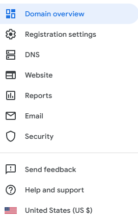
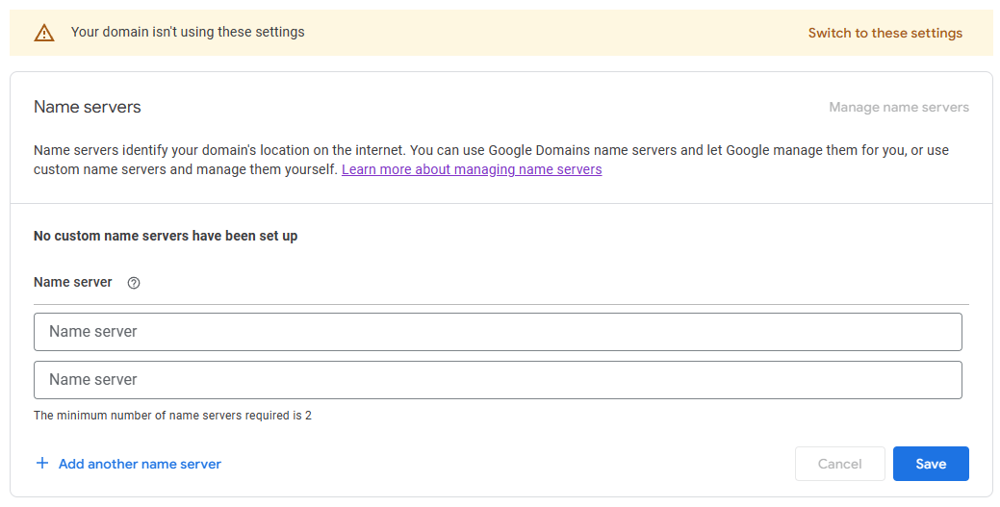

# Terraform managed Custom Domain Website

```shell
terraform plan -var_file="example.com.tfvars"
```

```shell
terraform plan \
  -var "domain_name=example.com" \
  -var "bucket_name=example.com" \
  -var "prefix=example_com" \
  -var "github_repo=user_name/repo_name"
```

I am assuming the domain is registered with Route 53. If not, [additional steps](#google-domains-configuration) are required for domains not registered with AWS (e.g. google domains)  

## AWS Components

AWS Components 
* S3  
* Route 53
* Certificate Manager (ACM)
* Cloudfront
* IAM
* Codebuild

## Features
 
* After copying files to S3, the buildspec creates a Cloudfront invalidation for path '/*' 

## Gotchas/Requirements

This template uses terraform, so of course you will need to have it setup, and be familiar with its workings. 

Terraform interacts with AWS and Github. Both of these environments (AWS CLI, AWS credentials, github authorization) need to be setup before scripts can be run.  

The S3 bucket as configured in this example is not versioned.

Terraform state files start to get tricky if you alter them after initial deployment. Personally I found a complete tear-down and recreation preferable over terraform commands   

## Google Domains Configuration

Domains hosted on Google can still be managed on AWS, with a few minor changes.

In AWS Route 53, create a new Hosted Zone whose name is the same as the domain (e.g. example.com)

A couple of DNS Records will be created for you, but you only care about the NS record. It will look something like this:

| Record name | Type | Routing policy | Differentiator | Alias | Value/Route traffic to | TTL (seconds) | Health check ID | Evaluate target health | Record ID |
|-------------|------|----------------|----------------|-------|---|---------------|-----------------|------------------------|-----------|
| example.com | NS   | Simple         | -              | No    | ns-873.awsdns-45.net. | 172800        | -               | -                      | -         |
| |    |          |              |     | ns-1519.awsdns-61.org. |         |                |                       |         |
| |    |          |               |     | ns-1642.awsdns-13.co.uk. |         |                |                       |          |
| |    |          |               |     | ns-313.awsdns-39.com. |         |                |                       |          |

Go to the [Google Domain console](https://domains.google.com/registrar/) (or wherever your domain is hosted) and update the name servers to point to these new values.

Select your domain, 
* click on DNS on the left panel
* select Custom name servers 
* 
* Enter the name servers provided by AWS Route 53 
* 
* When you are ready, select <span style="color: red">**_switch to these settings_**</span> on the upper left

Once you have completed this, AWS Route 53 is now handling DNS requests

## Helpful Links

Below are some of the articles I found helpful in guiding me to this solution.

* This guide (2023) [Hosting a static website using Amazon S3](https://docs.aws.amazon.com/AmazonS3/latest/userguide/WebsiteHosting.html) covers the basics on AWS Static Web PAge Hosting

* This guide (2023) [Hosting a Secure Static Website on AWS S3 using Terraform (Step By Step Guide)](https://www.alexhyett.com/terraform-s3-static-website-hosting/) was my starting point, and got me a good part of the way, but stumbled towards the more complicated parts of ACM as well as domain forwarding.

* ACM Rules coupled with Route 53 was very confusing for me. This guide (2023) [Managing acm with terraform](https://headforthe.cloud/article/managing-acm-with-terraform/) helped get past that hurdle.

* This guide (2023) [Mastering Static Website Hosting on AWS with Terraform: A Step-by-Step Tutorial](https://medium.com/@walid.karray/mastering-static-website-hosting-on-aws-with-terraform-a-step-by-step-tutorial-5401ccd2f4fb) was what I used in the end, as it very cleanly and succinctly described everything I had learned before. It also provided the trick to create a single bucket and cloudfront distribution. A much cleaner approach imho:  
